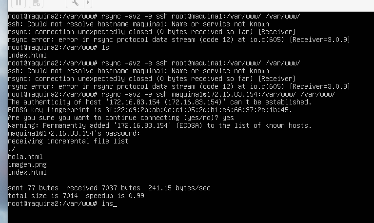
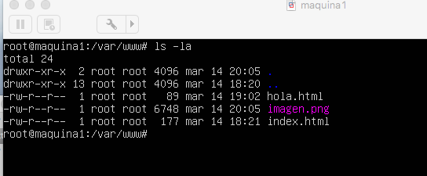
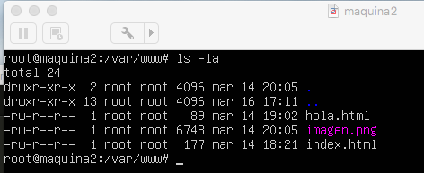

# Práctica 2

Cuestiones a resolver de la Práctica 2 : 

1. Probar el funcionamiento de la copia de archivos por ssh

Para probar el funcionamiento de la copia de archivos por ssh muestro la siguiente imagen:

2. Clonado de una carpeta entre las dos máquinas:

Para clonar la carpeta, en este caso la carpeta www de apache pongo el siguiente comando:

'rsync -avz -e ssh maquina1@172.16.83.154:/var/www/ /var/www/'

Donde maquina1 es el usuario de la máquina, y la Ip, la ip del servidor al que se mandará los datos. En la imagen muestro como se traspasan los datos desde la máquina2 a la máquina1.

A continuación muestros los datos en ambas máquinas

3. Acceso sin contraseña para ssh

Primero establezco la contraseña , lo muestro en la imagen :

4. Establecer una tarea en cron que se ejecute cada hora para mantener actualizado el contenido del directorio /var/www entre las dos máquinas

