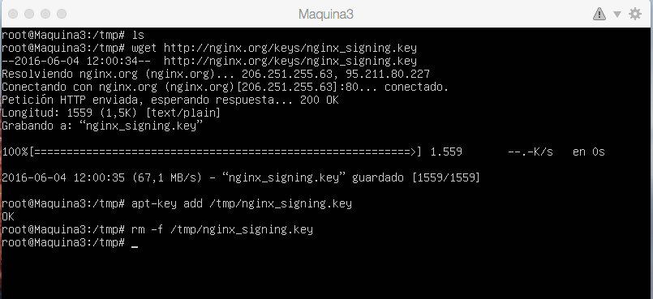
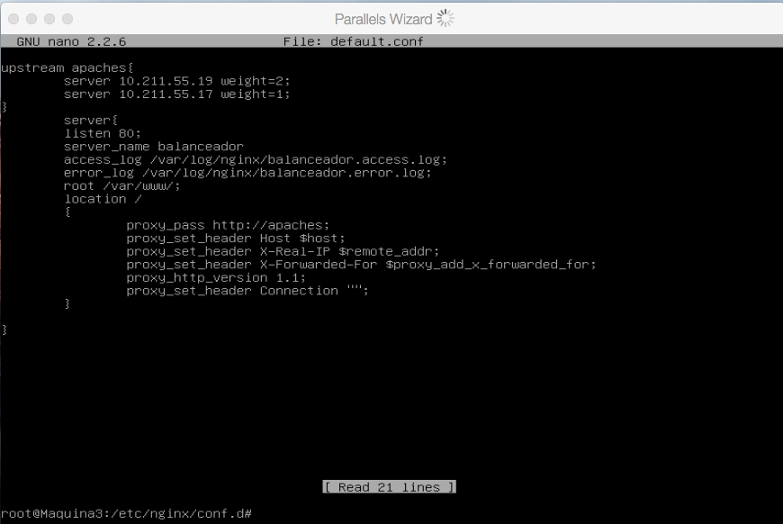
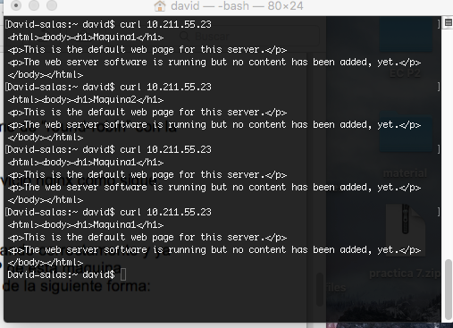
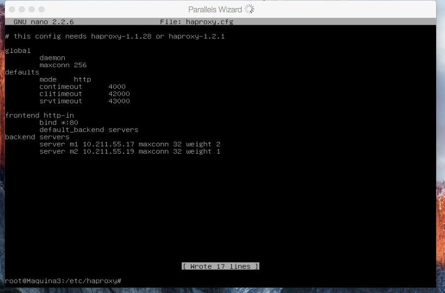
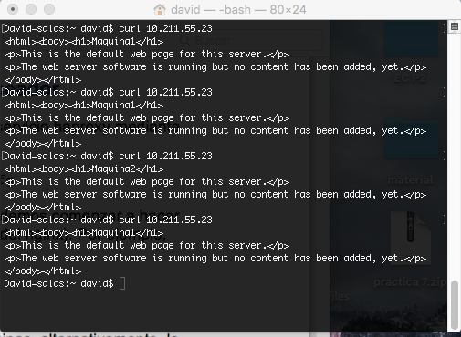

# Práctica 3

Cuestiones a resolver de la Práctica 3 : 

0. Creo una nueva máquina virtual , la llamo máquina 3, no le instalo Apache.

1. Instalación de NGINX (balanceador de carga):

Para instalar Nginx nos vamos a dirigir a la carpeta tmp, una vez alli lo primero que hago es importar la clave del repositorio del software:

wget http://nginx.org/keys/nginx_signing.key 
apt-key add /tmp/nginx_signing.key
rm -f /tmp/nginx_signing.key
En la imagen muestro como lo he realizado

A continuación, añado el repositorio al fichero /etc/apt/sources.list
Para ello, ejecuto las siguientes órdenes en el terminal:
echo "deb http://nginx.org/packages/ubuntu/ lucid nginx" >> /etc/apt/sources.list 
echo "deb-src http://nginx.org/packages/ubuntu/ lucid nginx" >> /etc/apt/sources.list

Ahora ya puedo instalar el paquete del nginx:

apt-get update apt-get install nginx

Una vez instalado , el paso siguiente será configurarlo

2.Configuración de Nginx

Para configurar Nginx debo modificar el archivo que se encuentra en la siguiente dirección /etc/nginx/conf.d/default.conf , introduzco los datos que se pueden ver en la imagen

En la imagen puedo ver como tengo las Ip de mis dos máquinas virtuales, además he configurado para que no salga la gestión Round-robin que tiene por defecto, he supuesto que el servidor 1 tiene el doble de capacidad que el 2, le añado la etiqueta weight para darles diferentes cargas a los diferentes equipos.
Una vez guardado el archivo, reinicio Nginx con el siguiente comando : 

service nginx restart

3. Prueba de funcionamiento

Para probarlo, la pruebo con la consola de sistema operativo anfitrión , en mi casa un MacBookPro 
En la imagen se puede ver como se van alternando las dos páginas web que he creado en las dos maquinas virtuales.

Como se puede observar la maquina1 aparece más , ya que como he contado antes, la he configurado para que tenga más peso que la otra, he supuesto que es más potente y por tanto entra más en juego que la otra.

4.Instalación de Haproxy

En mi máquina 3 instalo Haproxy, para ello pongo el siguiente comando:

sudo apt-get install haproxy

5.Configuración de Haproxy

Para configurar Haproxy , modifico el archivo que se encuentra en la dirección  /etc/haproxy/haproxy.cfg como hice con el otro, en la siguiente captura se puede ver los datos que he cambiado:

En la imagen se puede ver como he puesto las IP de los ordenadores junto tambien como con Nginx le he cambiado la carga , y he establecido diferentes cargas en cada uno de ellos con la propiedad weight .

5. Prueba de funcionamiento

Para probarlo, la pruebo con la consola de sistema operativo anfitrión , en mi casa un MacBookPro 
Y ahora se puede ver en la siguiente captura el reparto de solicitudes a nuestra granja web:

Como se puede observar la maquina1 aparece más , ya que como he contado antes, la he configurado para que tenga más peso que la otra, he supuesto que es más potente y por tanto entra más en juego que la otra.

