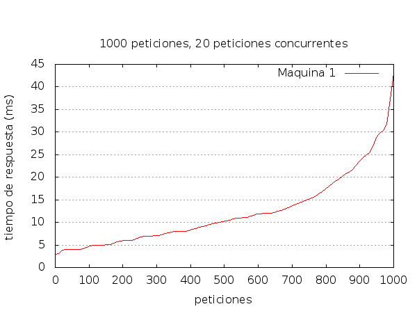
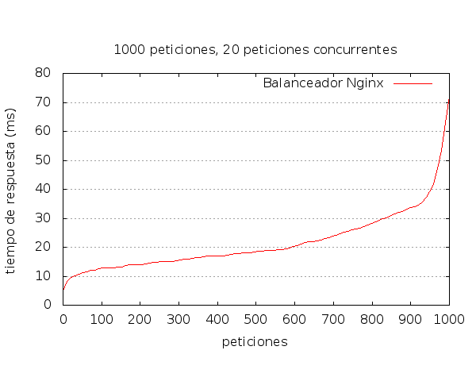

# Práctica 4

Cuestiones a resolver de la Práctica 4 : 

Resultado de las 1000 peticiones en la Máquina 1

Resultado de las 1000 peticiones en el balanceador con Nginx

Resultado de las 1000 peticiones en el balanceador con Haproxy

Tabla con los datos más significativos, los he repetido 5 veces:

|            |   Haproxy  |    Nginx    |  Máquina 1 |
| ---------- | ---------- |  ---------- | ---------- |
| Time taken for test   | 1,157 seconds   | 1,201 seconds | 0,640 seconds |
| Failed request   | 0  |  0  | 0  |
| Requed per second  | 864,40 [#/sec]   |  832,63 [#/sec] | 1561,76 [#/sec] |
| Time taken for test   | 1,154 seconds   | 1,197 seconds | 0,530 seconds |
| Failed request   | 0  |  0  | 0  |
| Requed per second  | 834,10 [#/sec]   |  812,12 [#/sec] | 1131,81 [#/sec] |
| Time taken for test   | 1,231 seconds   | 1,205 seconds | 0,541 seconds |
| Failed request   | 0  |  0  | 0  |
| Requed per second  | 864,40 [#/sec]   |  837,62 [#/sec] | 1121,12 [#/sec] |
| Time taken for test   | 1,456 seconds   | 1,321 seconds | 0,643 seconds |
| Failed request   | 0  |  0  | 0  |
| Requed per second  | 894,80 [#/sec]   |  838,67 [#/sec] | 1561,33 [#/sec] |
| Time taken for test   | 1,127 seconds   | 1,201 seconds | 0,658 seconds |
| Failed request   | 0  |  0  | 0  |
| Requed per second  | 865,66 [#/sec]   |  822,97 [#/sec] | 1231,19 [#/sec] |

