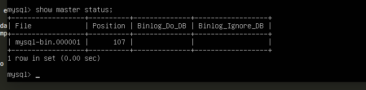

# Práctica 5

Cuestiones a resolver de la Práctica 5 : 

1.Primero creo la base de datos:

Para crear la base de datos utilizo el siguiente comando

~~~
create database empresa;
use empresa;
~~~

Ahora le crearé una tabla y le asignaré algunos datos

~~~
create table informacion(id int,usuario varchar(50),departamento varchar(50));
insert into informacion(id,usuario,departamento) values (1,"david","departamento web");
~~~

En la siguiente imagen muestro los datos de nuestra base de datos que he creado

2.Realizar la copia de seguridad de la base de datos

Para realizar la copia de seguridad de la base de datos voy a utilizar mysqldump.
Algo importante es que cuando estemos haciendo la copia de seguridad no pueda acceder nadie a la base de datos ni realicen cambios en la base de datos, para ello los cambios que realizaré se pueden visualizar en la siguiente imagen .

Una vez he bloqueado las tablas para que no puedan modificarlas mientras hago la copia de seguridad , procedo a guardar los datos con mysqldump , en la imagen siguiente muestro como lo hago:

Una vez realizada la copia de seguridad de la base datos, vuelvo a desbloquear las tablas que he bloqueado antes:

3.Restaurar la copia de seguridad en la máquina 2

A continuación , la copia de seguridad de la base de datos que he creado en la máquina 1 la voy  a replicar en la máquina 2, para ello , lo primero que tengo que hacer es crear la misma base de datos empresa en la máquina 2, en la imagen muestro la base de datos en la máquina 2:

Ahora ejecuto el siguiente comando para traerme a la máquina2 la base de datos de la máquina 1 e importar sus tablas y su información.

~~~
scp root@10.211.55.19:/home/maquina1/empresa.sql /root/

sudo mysql -u root -p empresa < /root/empresa.sql
~~~

Por último muestro la base de datos con los datos importados en la siguiente imágen :

4. Configuración maestro - esclavo

Al configurar las dos máquinas con maestro - esclavo , podremos realizar la copia de seguridad automáticamente, es muy útil.
Para la configuración, me voy a la máquina 1 y edito el archivo /etc/mysql/my.cnf y edito las líneas que voy a comentar a continuación:

- Comento la línea bind-address 127.0.0.1
- Descomento la línea log_error = /var/log/mysql/error.log
- Establezco el identificador del servidor con : server-id = 1
- Configuro el registro binario con : log_bin = /var/log/mysql/bin.log

Guardo el archivo y reinicio mysql para que los cambios hagan efecto :

~~~
/etc/init.d/mysql restart
~~~

Ahora voy a crear en el maestro un usuario y le doy los permisos, para ello introduzco los comandos que aparecen en la siguiente imagen:

Una vez hecho eso , para obtener los de la base de datos para configurar el esclavo ejecuto el siguiente código que me muestra lo siguiente :

En mmi caso , esos datos no aparecieron a la primera, mi base de datos es la versión 5.5.38, cuando ponía ese comando me aparecía en la consola de mysql Empty set (0.00 sec) . Para solucionarlo hice lo siguiente:

~~~
touch /var/lib/mysql/mysql-bin.log
nano /etc/my.cnf 
log-bin = /var/lib/mysql/mysql-bin.log 
~~~

Guardé , salí y reinicié el servicio, y ya me apareció esos datos que los necesitaba para añadirlo a la configuración de la otra máquina.
Una vez realizado esto, realizo los mismo pasos con la otra máquina, la única diferencia es que pondré server-id =2 en el archivo de configuración:

edito el archivo /etc/mysql/my.cnf:

- Comento la línea bind-address 127.0.0.1
- Descomento la línea log_error = /var/log/mysql/error.log
- Establezco el identificador del servidor con : server-id = 2
- Configuro el registro binario con : log_bin = /var/log/mysql/bin.log

Guardo el archivo y reinicio mysql para que los cambios hagan efecto :

~~~
/etc/init.d/mysql restart
~~~

Ejecuto en la línea de comandos de mysql lo siguiente , donde master host será la Ip de la máquina 1 , añadiré el archivo que mostraba antes por consola y el master

~~~
CHANGE MASTER TO MASTER_HOST='10.211.55.19', MASTER_USER='esclavo', MASTER_PASSWORD='esclavo', MASTER_LOG_FILE='mysql-bin.000001', MASTER_LOG_POS=107, MASTER_PORT=3306;
~~~

~~~
START SLAVE;
~~~

Realizado esto, desbloqueo las tablas

~~~
UNLOCK TABLES;
~~~

Por último para comprobar que la configuración está correctamente pongo 

~~~
SHOW SLAVE STATUS\G
~~~

Me fijo en el 0 , y como se puede ver en la imagen hay 0 en el second_behind_master, es decir no esta null 

Por último , para corroborar que todo funciona correctamente, en la imagen muestro dos consultas, la primera la hago antes de insertar datos en la otra máquina, la siguiente consulta la hago despues de insertar en la otra máquina , y como se puede observar , en la primera consulta solo hay un dato y en la siguiente consulta aparecen dos, por tanto ,he realizado correctamente la replicación de la base de datos , lo muestro en la siguiente imagen :

