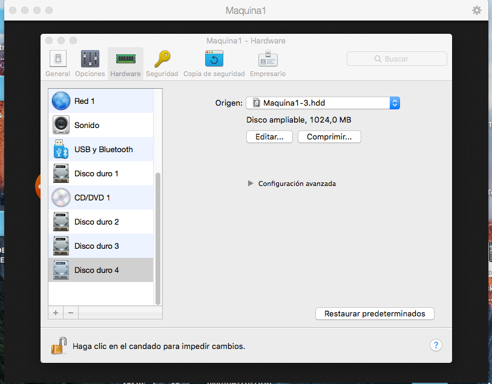
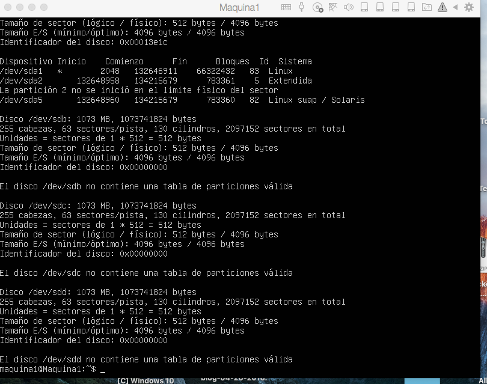
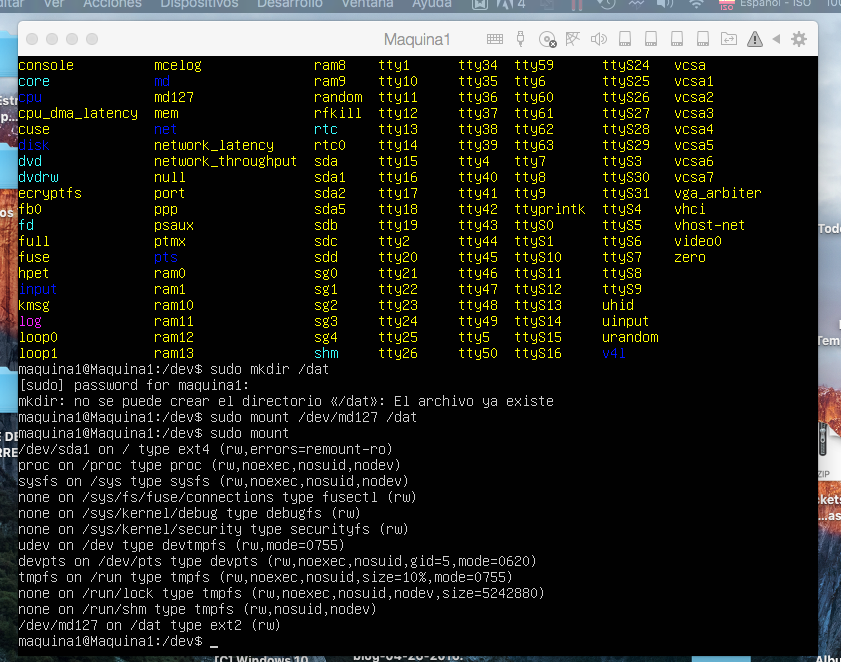
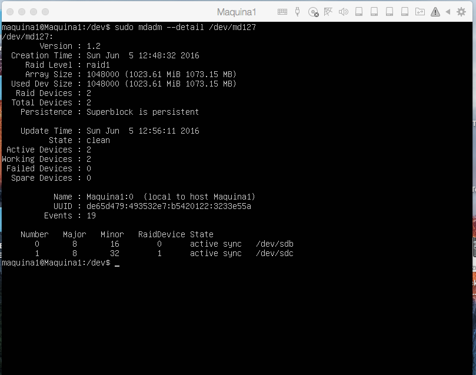
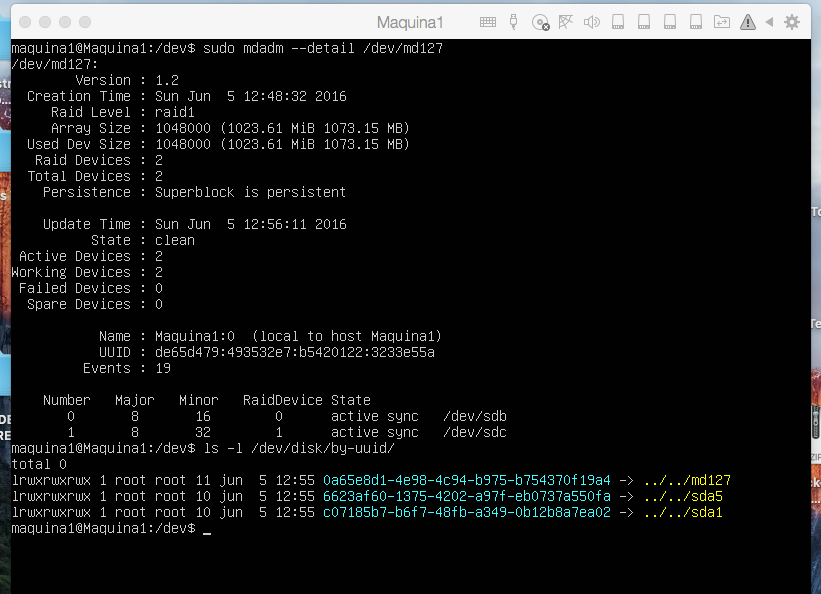
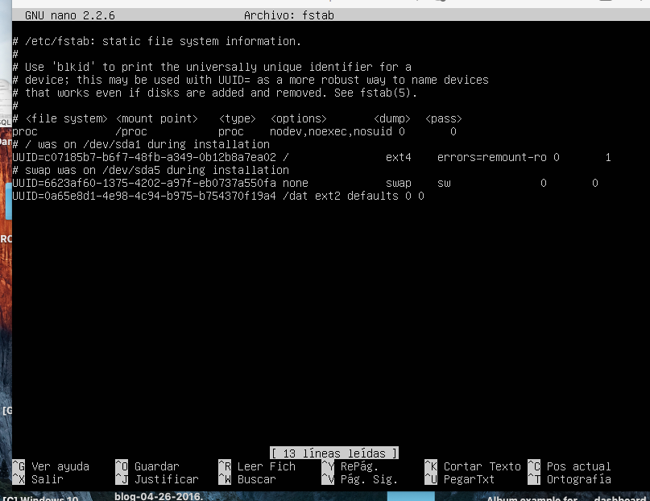
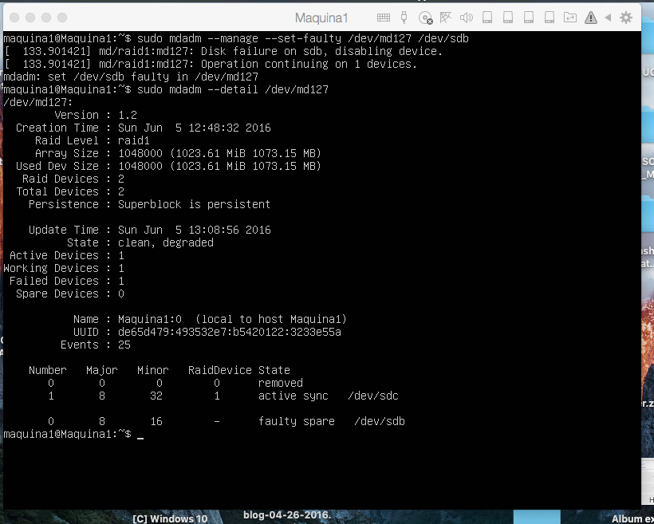
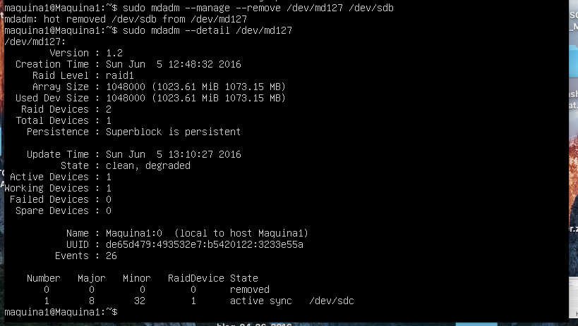
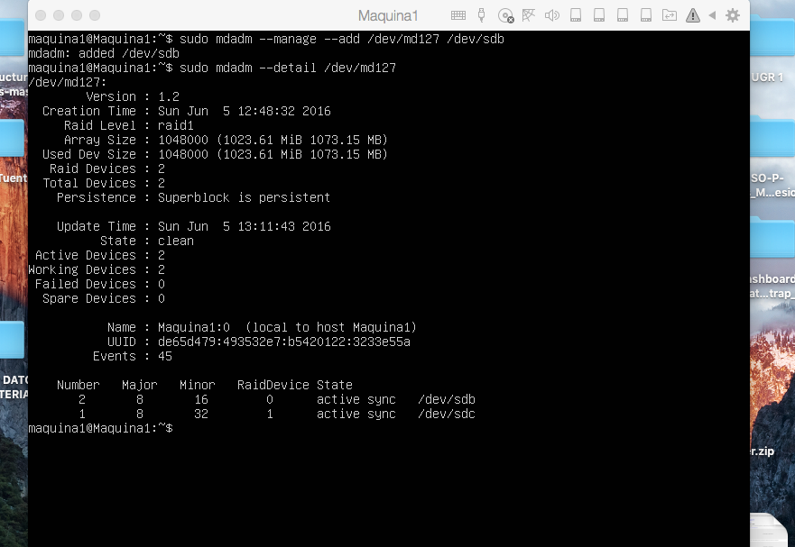
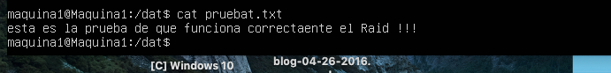

# Práctica 6

Cuestiones a resolver de la Práctica 6 : 

1.Configuración del Raid.

Lo primero que hago es añadir 4 discos duros (aqunque al final no los utilizo todos) de 1 Gb con el Parallels Desktop

En la siguiente imagen muestro los datos de los discos duros , para comprobar que el sistema operativo los detecta, utilizo el comando:

~~~
sudo fdisk -l
~~~

A continuación instalo el mdadm con el comando :

~~~
sudo apt-get install mdadm
~~~

Ahora configuro el RAID 1, utilizaré el dispositivo /dev/md0. Para ello lanzo el siguiente comando:

~~~
sudo mdadm -C /dev/md0 --level=raid1 --raid-devices=2 /dev/sdb /dev/sdc
~~~

Reinicio la máquina para que los cambios hagan efecto , ahora ha pasado de llamarse /dev/md0 a /dev/md127.

Le doy formato ext2 ejecutando el siguiente comando:

~~~
sudo mkfs /dev/md0
~~~

Creo el directorio donde voy a montar la unidad del RAID, ejecuto los siguientes comandos:

~~~
sudo mkdir /dat
sudo mount /dev/md127 /dat
~~~

Como podemos ver en la siguiente captura, la unidad /dev/md127 está montada en /dat con formato ext2:

~~~
sudo mount
~~~

Ahora quiero comprobar como se encuentra el Raid, para ello introduzco el siguiente comando:

~~~
sudo mdadm --detail /dev/md127
~~~

Y aparecerá lo que se puede ver en la siguiente imagen :

Configuro el sistema para que monte el RAID al arrancar el sistema, modificando el archivo /etc/fstab, y añado una nueva línea correspondiente para montar automáticamente el dispositivo.

Para averiguar el UUID del disco md127 ejecutamos el siguiente comando:

~~~
ls -l /dev/disk/by-uuid/
~~~

Me aparece la información que se puede ver en la siguiente imagen :

Ahora ya tengo el UUID, añado la línea al fichero /etc/fstab , en la siguiente imagen aparece como queda:

Guardo el fichero, y reinicio la máquina virtual para que hagan efecto los cambios.

2.Fallo en los discos del Raid

A continuación voy a crear un fallo en los discos del Raid,para ello voy a ejecutar el siguiente comando que simulará un fallo en uno de los discos:

~~~
sudo mdadm --manage --set-faulty /dev/md127 /dev/sdb
~~~

Y con el comando:

~~~
sudo mdadm --detail /dev/md127
~~~

Podemos ver el estado del dispositivo RAID y posteriormente accedemos satisfactoriamente a un fichero del sistema RAID:

Ahora puedo eliminar "en caliente" el disco que está marcado como que ha fallado con el siguiente comando:

~~~
sudo mdadm --manage --remove /dev/md127 /dev/sdb
~~~

En la imágen puedo ver el estado del Raid después de eliminar el disco:

Para finalizar voy a volver a añadir al sistema RAID el disco que hemos eliminado anteriormente con el comando:

~~~
sudo mdadm --manage --add /dev/md127 /dev/sdb
~~~

Ahora el sistema empezará a reconstruir el sistema RAID. En mi caso, al no ser un disco duro muy grande, y además es SSD, la reconstrucción ha sido muy rápido y directamente me lo ha mostrado ya correctamente, pero en otros casos aparece en reconstrucción, en la siguiente imagen aparece como queda el Raid finalmente:

Ahora para corroborar que todo funciona correctamente , muestro en la siguiente imagen como accedo a un documento del Raid y lo muestro correctamente con cat:

