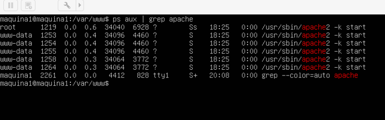

# Práctica 1

Muestro con imágenes la práctica 1, los dos objetivos que había que realizar 

Por un lado :

- Mostrar la versión de apache instalado en la máquina virtual , pongo el comando : 

	apache2 -v

- Por otro lado poner el comando en la máquina virtual :

	ps aux | grep apache

